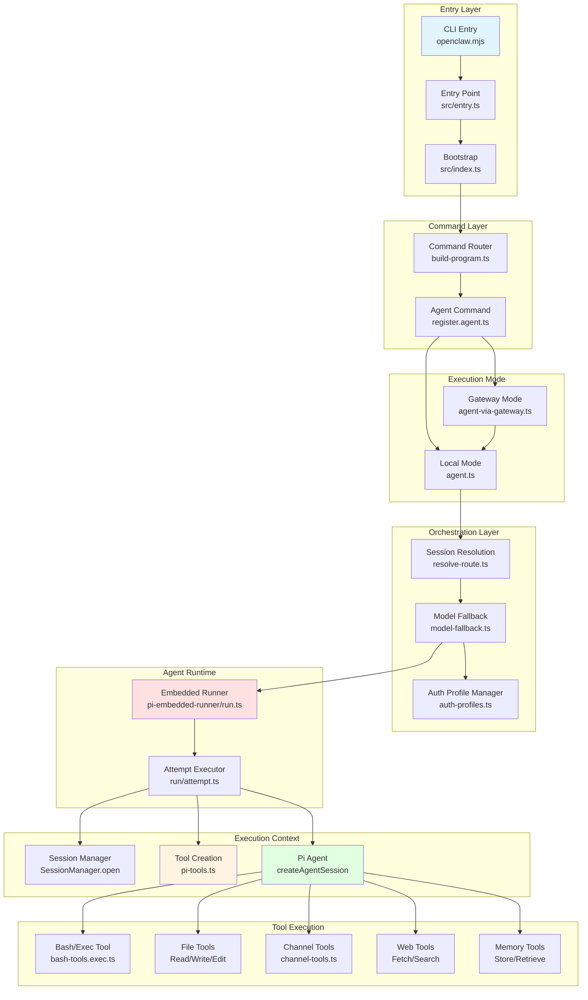
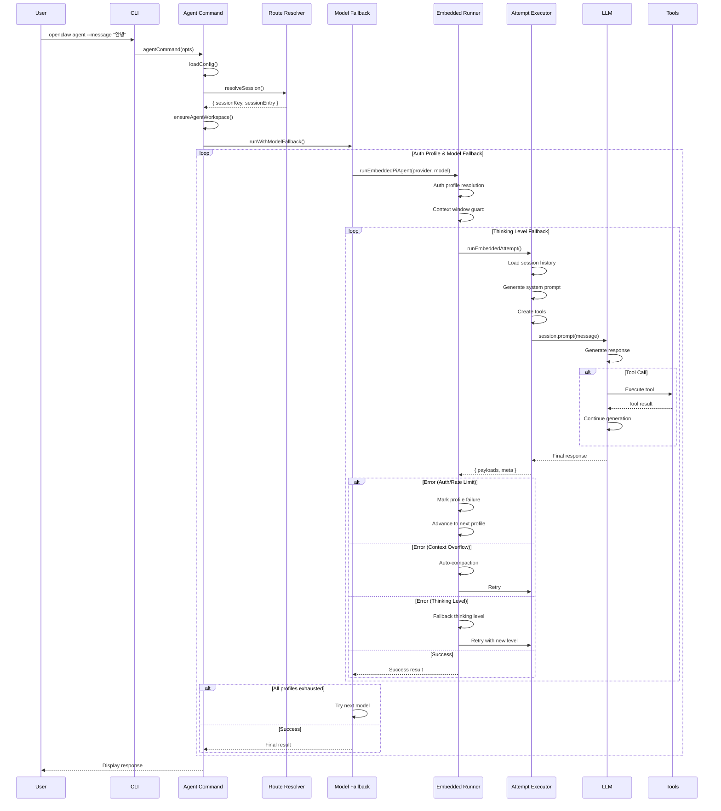
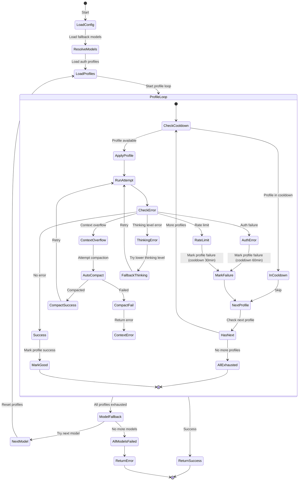
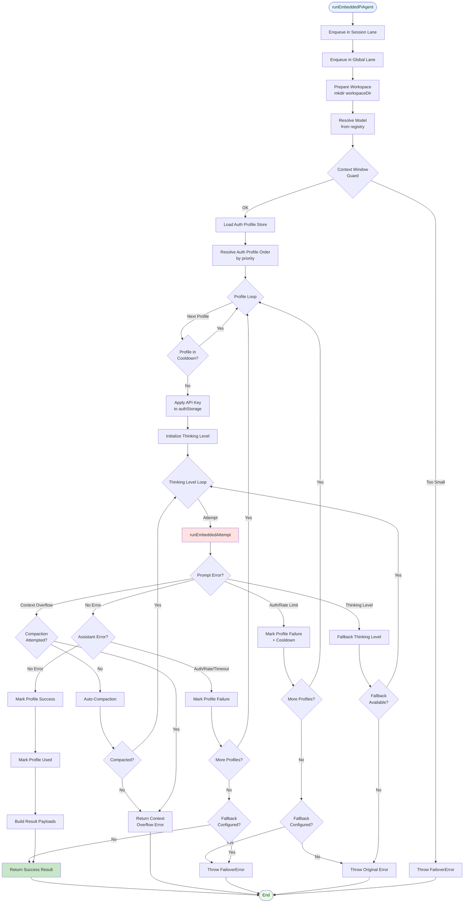
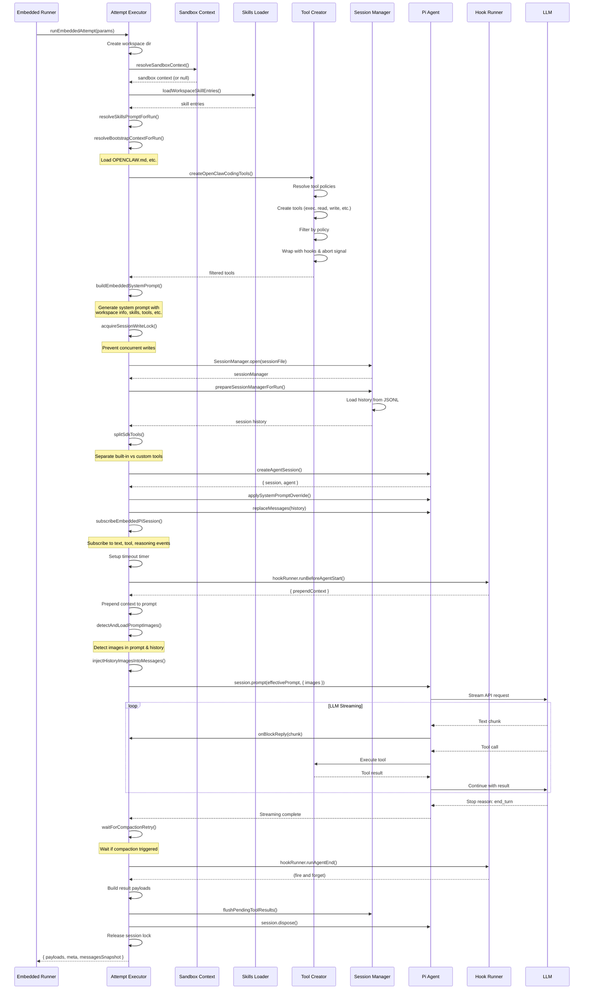
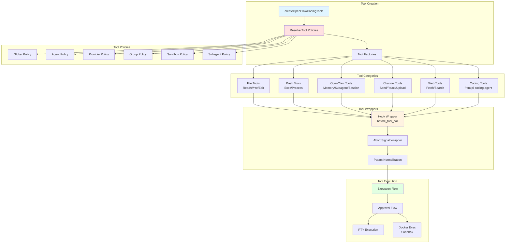
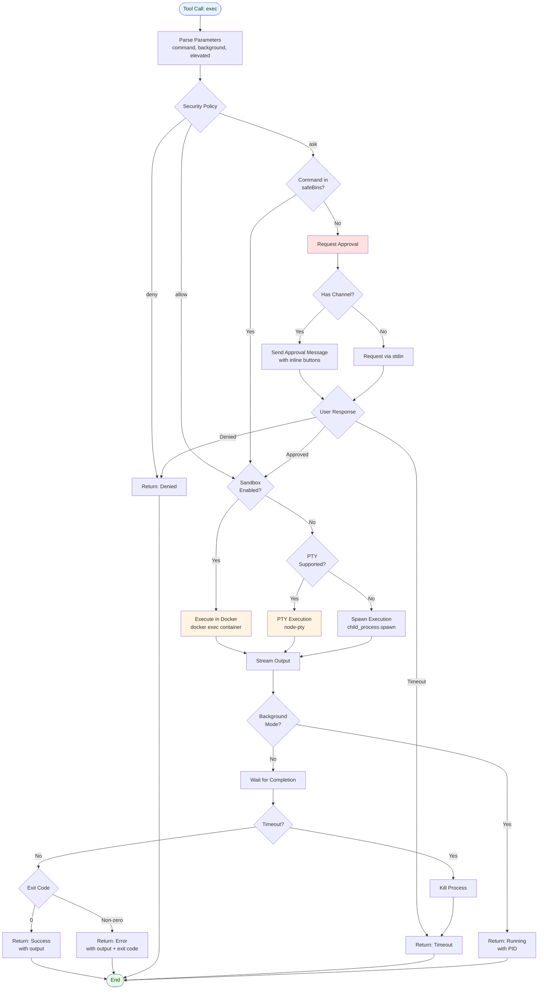
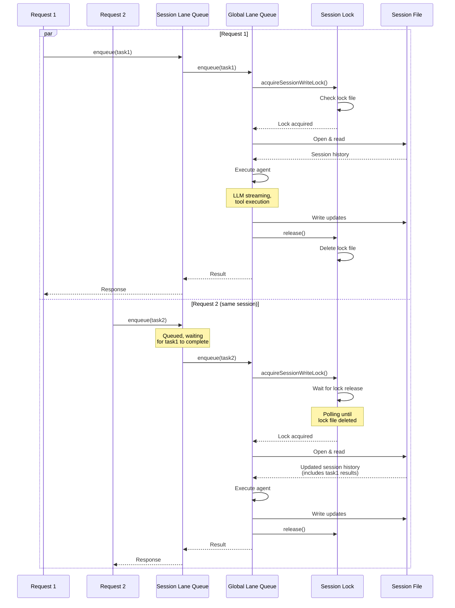
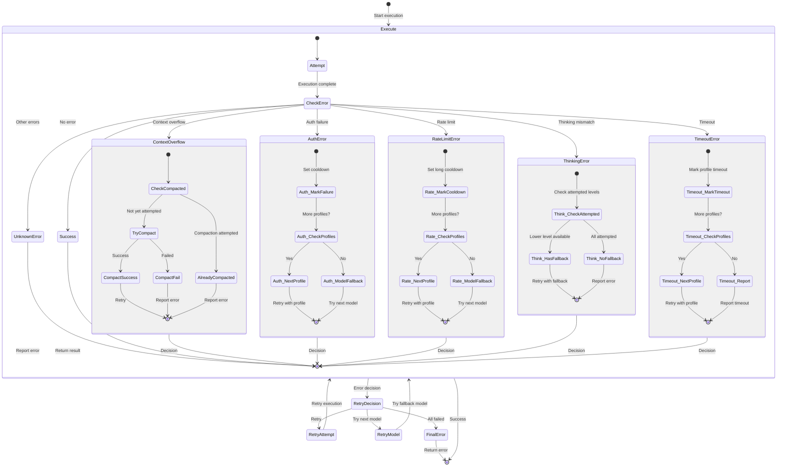

# OpenClaw Architecture Diagrams

이 문서는 OpenClaw 에이전트 시스템의 아키텍처를 Mermaid 다이어그램으로 시각화합니다.

---

## 1. 전체 시스템 아키텍처



---

## 2. 사용자 질의 처리 흐름



---

## 3. 세션 라우팅 메커니즘

```mermaid
flowchart TD
    Start([User Request]) --> Input[Input:<br/>channel, accountId,<br/>peer, guildId, teamId]
    Input --> LoadBindings[Load Routing Bindings<br/>from config]
    LoadBindings --> FilterChannel{Match Channel?}

    FilterChannel -->|No| NoBinding[No Binding Found]
    FilterChannel -->|Yes| FilterAccount{Match AccountId?}

    FilterAccount -->|No| NoBinding
    FilterAccount -->|Yes| CheckPeer{Peer exists?}

    CheckPeer -->|Yes| MatchPeer{Match Peer?}
    MatchPeer -->|Yes| ReturnPeer[Return Agent<br/>matchedBy: binding.peer]
    MatchPeer -->|No| CheckParent{Parent Peer?}

    CheckParent -->|Yes| MatchParent{Match Parent?}
    MatchParent -->|Yes| ReturnParent[Return Agent<br/>matchedBy: binding.peer.parent]
    MatchParent -->|No| CheckGuild

    CheckPeer -->|No| CheckGuild{Guild exists?}
    CheckGuild -->|Yes| MatchGuild{Match Guild?}
    MatchGuild -->|Yes| ReturnGuild[Return Agent<br/>matchedBy: binding.guild]
    MatchGuild -->|No| CheckTeam

    CheckGuild -->|No| CheckTeam{Team exists?}
    CheckTeam -->|Yes| MatchTeam{Match Team?}
    MatchTeam -->|Yes| ReturnTeam[Return Agent<br/>matchedBy: binding.team]
    MatchTeam -->|No| CheckAccountBinding

    CheckTeam -->|No| CheckAccountBinding{Specific Account Binding?}
    CheckAccountBinding -->|Yes| ReturnAccount[Return Agent<br/>matchedBy: binding.account]
    CheckAccountBinding -->|No| CheckWildcard{Wildcard Binding<br/>accountId: "*"?}

    CheckWildcard -->|Yes| ReturnChannel[Return Agent<br/>matchedBy: binding.channel]
    CheckWildcard -->|No| NoBinding

    NoBinding --> ReturnDefault[Return Default Agent<br/>matchedBy: default]

    ReturnPeer --> BuildKey[Build Session Key]
    ReturnParent --> BuildKey
    ReturnGuild --> BuildKey
    ReturnTeam --> BuildKey
    ReturnAccount --> BuildKey
    ReturnChannel --> BuildKey
    ReturnDefault --> BuildKey

    BuildKey --> SessionKey[Session Key:<br/>agentId:channel:accountId:peerKind:peerId]
    SessionKey --> End([Return Route])

    style Start fill:#e1f5ff
    style End fill:#e1ffe1
    style ReturnPeer fill:#ffe1e1
    style ReturnDefault fill:#fff3e1
```

---

## 4. 모델 폴백 및 Auth Profile 순환



---

## 5. Embedded Agent Runner 실행 흐름



---

## 6. Attempt Executor 상세 흐름



---

## 7. Tool Execution 아키텍처



---

## 8. Bash/Exec Tool 실행 흐름



---

## 9. Session Lock 및 동시성 제어



---

## 10. Tool Policy 해결 흐름

```mermaid
flowchart TD
    Start([Tool Execution Request]) --> LoadPolicies[Load All Policies]

    LoadPolicies --> GlobalPolicy[Global Policy<br/>config.tools.policy.global]
    LoadPolicies --> AgentPolicy[Agent Policy<br/>config.agents.list[id].tools]
    LoadPolicies --> ProviderPolicy[Provider Policy<br/>config.agents.defaults.models[provider].tools]
    LoadPolicies --> GroupPolicy[Group Policy<br/>config.tools.policy.groups]
    LoadPolicies --> SandboxPolicy[Sandbox Policy<br/>config.sandbox.sessions[key].policy]
    LoadPolicies --> SubagentPolicy[Subagent Policy<br/>derived from parent]

    GlobalPolicy --> CheckGlobal{Global<br/>Allows?}
    CheckGlobal -->|No| Denied[Tool Denied]
    CheckGlobal -->|Yes| CheckAgent

    AgentPolicy --> CheckAgent{Agent<br/>Allows?}
    CheckAgent -->|No| Denied
    CheckAgent -->|Yes| CheckProvider

    ProviderPolicy --> CheckProvider{Provider<br/>Allows?}
    CheckProvider -->|No| Denied
    CheckProvider -->|Yes| CheckGroup

    GroupPolicy --> CheckGroup{Group<br/>Allows?}
    CheckGroup -->|No| Denied
    CheckGroup -->|Yes| CheckSandbox

    SandboxPolicy --> CheckSandbox{Sandbox<br/>Allows?}
    CheckSandbox -->|No| Denied
    CheckSandbox -->|Yes| CheckSubagent

    SubagentPolicy --> CheckSubagent{Subagent<br/>Allows?}
    CheckSubagent -->|No| Denied
    CheckSubagent -->|Yes| Allowed[Tool Allowed]

    Allowed --> ExecuteTool[Execute Tool]
    Denied --> ReturnError[Return: Permission Denied]

    ExecuteTool --> End([End])
    ReturnError --> End

    style Start fill:#e1f5ff
    style End fill:#e1ffe1
    style Allowed fill:#c8e6c9
    style Denied fill:#ffcdd2
```

**Policy Resolution Logic**:

```typescript
function isToolAllowedByPolicy(
  toolName: string,
  policy: { allow?: string[]; deny?: string[] }
): boolean {
  // 1. Check deny list (높은 우선순위)
  if (policy.deny?.includes(toolName)) return false;
  if (policy.deny?.includes("*")) return false;

  // 2. Check allow list
  if (policy.allow?.includes("*")) return true;
  if (policy.allow?.includes(toolName)) return true;

  // 3. Default: deny if allow list exists
  if (policy.allow && policy.allow.length > 0) return false;

  // 4. Default: allow if no policy
  return true;
}

// 최종 판단: AND 연산 (모든 정책 통과해야 허용)
const allowed =
  isToolAllowedByPolicy(tool, globalPolicy) &&
  isToolAllowedByPolicy(tool, agentPolicy) &&
  isToolAllowedByPolicy(tool, providerPolicy) &&
  isToolAllowedByPolicy(tool, groupPolicy) &&
  isToolAllowedByPolicy(tool, sandboxPolicy) &&
  isToolAllowedByPolicy(tool, subagentPolicy);
```

---

## 11. 데이터 흐름 다이어그램

```mermaid
graph LR
    subgraph "Input"
        User[User Message]
        Images[Images]
        Config[Config]
    end

    subgraph "Session State"
        SessionStore[Session Store<br/>sessions.json]
        SessionFile[Session File<br/>{sessionKey}.jsonl]
        Skills[Skills Snapshot]
    end

    subgraph "Runtime Context"
        Workspace[Workspace Dir]
        Bootstrap[Bootstrap Files<br/>OPENCLAW.md]
        AgentDir[Agent Dir<br/>~/.openclaw]
        Models[Model Registry]
        AuthStore[Auth Profile Store]
    end

    subgraph "Execution"
        SystemPrompt[System Prompt<br/>Generation]
        History[History<br/>Management]
        Tools[Tool Registry]
        LLM[LLM API]
    end

    subgraph "Output"
        Response[Assistant Response]
        ToolResults[Tool Results]
        SessionUpdate[Updated Session<br/>State]
    end

    User --> SessionStore
    Config --> SessionStore
    SessionStore --> SessionFile

    SessionFile --> History
    Skills --> SystemPrompt
    Config --> SystemPrompt
    Bootstrap --> SystemPrompt
    Workspace --> SystemPrompt
    Models --> SystemPrompt

    SystemPrompt --> LLM
    History --> LLM
    Tools --> LLM
    Images --> LLM
    AuthStore --> LLM

    LLM --> Response
    LLM --> Tools
    Tools --> ToolResults

    Response --> SessionUpdate
    ToolResults --> SessionUpdate
    SessionUpdate --> SessionFile
    SessionUpdate --> SessionStore

    Response --> User

    style User fill:#e1f5ff
    style LLM fill:#ffe1e1
    style Response fill:#e1ffe1
```

---

## 12. Error Handling 및 Retry 전략



---

이 다이어그램들은 OpenClaw 에이전트 시스템의 핵심 아키텍처와 동작 방식을 시각화한 것입니다. 각 다이어그램은 서로 다른 관점에서 시스템을 설명하며, 전체적인 이해를 돕기 위해 작성되었습니다.
