# Brity Works 메신저 봇 개발 설계문서

> **문서 버전**: v2.0  
> **작성일**: 2026-02-04  
> **대상 솔루션**: Samsung SDS Brity Works REST API v2  
> **목적**: Brity Works API 기반 메신저 봇 인터페이스 설계 및 개발 가이드

---

## 목차

1. [개요](#1-개요)
2. [API 연계 시작하기](#2-api-연계-시작하기)
3. [API 스펙 상세](#3-api-스펙-상세)
   - 3.1 [인증 (OAuth 2.0)](#31-인증-oauth-20)
   - 3.2 [메신저 API](#32-메신저-api)
   - 3.3 [메일 API](#33-메일-api)
   - 3.4 [캘린더 API](#34-캘린더-api)
   - 3.5 [임직원/주소록 API](#35-임직원주소록-api)
   - 3.6 [결재 API](#36-결재-api)
   - 3.7 [게시판 API](#37-게시판-api)
4. [시스템 아키텍처 설계](#4-시스템-아키텍처-설계)
5. [시퀀스 다이어그램](#5-시퀀스-다이어그램)
6. [봇 명령어 처리 플로우](#6-봇-명령어-처리-플로우)
7. [토큰 라이프사이클 관리](#7-토큰-라이프사이클-관리)
8. [에러 핸들링](#8-에러-핸들링)
9. [배포 아키텍처](#9-배포-아키텍처)
10. [부록](#10-부록)

---

## 1. 개요

### 1.1 Brity Works란

Brity Works는 삼성SDS의 기업용 협업 솔루션으로, 메신저·메일·캘린더·결재·게시판 등 통합 업무 환경을 제공합니다. REST API v2를 통해 외부 시스템과 연계할 수 있으며, 본 문서는 이 API를 활용한 메신저 봇 개발을 위한 설계문서입니다.

### 1.2 봇 개발 목표

- Brity Messenger를 통한 사용자 인터페이스 제공
- 자연어 기반 명령 처리 (일정 조회, 메일 발송, 임직원 검색 등)
- 외부 시스템 이벤트 기반 알림 전송
- 다중 턴(Multi-Turn) 대화 지원

### 1.3 문서 범위

본 문서는 Brity Works Dev Center / Knox Center의 API 가이드 문서 스크린샷에서 추출한 정보를 기반으로 작성되었습니다. 이미지 해상도 제한으로 일부 파라미터 세부사항은 추정이 포함되어 있으므로, Dev Center의 원본 문서와 대조하여 보완이 필요합니다.

---

## 2. API 연계 시작하기

### 2.1 사전 준비

Brity Works REST API를 사용하려면 먼저 **연계 신청**을 통해 다음 정보를 발급받아야 합니다:

| 항목 | 설명 |
|------|------|
| **System-ID** | 인증된 시스템 인지 확인하는 수단 |
| **Client Credentials** | Access Token 획득에 필요한 인증 정보 |

- 연계 신청 프로세스가 완료되면 신청자의 이메일로 전달됩니다.
- System-ID와 Access Token 정보를 HTTP(S) 헤더에 포함해야 합니다.

> ⚠️ Access Token은 보안 강화를 위해 **주기적으로 만료**됩니다 (1일).  
> ⚠️ API 호출 시 악성 코드나 부적절한 데이터가 포함되지 않도록 주의하세요.

### 2.2 호스트 정보

| 환경 | 호스트 | 용도 |
|------|--------|------|
| **스테이지** | `openapi.stage.brityworks.com` | 개발/테스트 |
| **운영** | `openapi.brityworks.com` | 프로덕션 |

### 2.3 방화벽 정책

| 구분 | 정책 |
|------|------|
| 스테이지 / 운영 환경 | Inbound Any Open |
| 서버 (테스트용 PC 포함)의 Outbound 방화벽이 존재할 경우 | 해당 사업장 담당자를 통하여 방화벽 오픈 신청 필요 |

### 2.4 API 버전

- Brity Works REST API는 개선된 **v2 버전**으로 제공되고 있습니다.
- v1 버전은 더 이상 신규 신청이 불가능합니다.

---

## 3. API 스펙 상세

### 3.1 인증 (OAuth 2.0)

#### 3.1.1 Access Token 획득

전달받은 Client Credentials값을 통해 Access Token을 획득합니다.  
Access Token은 주기적으로 만료되는 값이므로, 자체적으로 DB와 같은 저장소에 저장하여 관리해야 합니다.

**Request**

```
POST {연계 대상 환경에 맞는 호스트}:443/oauth2/token
```

| 항목 | 값 |
|------|---|
| **URL** | `https://openapi.stage.brityworks.com:443/oauth2/token` (스테이지) |
|         | `https://openapi.brityworks.com:443/oauth2/token` (운영) |
| **Method** | POST |

**Request Header**

| Header | Value |
|--------|-------|
| Authorization | `Basic {Client Credentials 값}` |
| Content-Type | `application/x-www-form-urlencoded` |

**Request Body**

| Parameter | Value | 비고 |
|-----------|-------|------|
| grant_type | `client_credentials` | 고정값 |
| scope | `{unique value}` | timestamp 등 고유한 값으로 설정하여 호출 시마다 상이한 값으로 요청해야 합니다. 예: `2019070417210000` |

**Response 예시**

```json
{
    "access_token": "eyJ4NXQiOiNV...loHt21bx8z...",
    "scope": "default",
    "token_type": "Bearer",
    "expires_in": 864000
}
```

| 필드 | 설명 |
|------|------|
| access_token | API 호출 시 사용할 토큰 |
| scope | 범위 (default) |
| token_type | Bearer |
| expires_in | 만료시간 (초). 864000초 ≈ 10일 |

#### 3.1.2 실제 API 호출 방법

Access Token과 System ID를 활용한 실제 API 호출:

**공통 Request Header**

| Header | Value |
|--------|-------|
| Authorization | `Bearer {access_token}` |
| System-ID | `{발급받은 System-ID}` (예: `KCS20REST00001`) |
| Content-Type | `application/json` |
| Accept | `application/json` |

**cURL 예시 (임직원 조회)**

```bash
curl -k -X POST \
  "https://openapi.stage.brityworks.com/employee/api/v2.0/employees?companyCode=S20&epids=M24062008430S5207316%2CC2304030806305202222" \
  -H "accept: application/json" \
  -H "System-ID: KCS20REST00001" \
  -H "Content-Type: application/json" \
  -H "Authorization: Bearer {획득한 Access Token}" \
  -d '{"resultType":"basic"}'
```

#### 3.1.3 토큰 만료 시 갱신

발급된 Access Token은 주기적으로 만료됩니다. 만료될 경우 아래 메시지가 리턴됩니다.

**Access Token 만료 응답 (HTTP 401)**

```json
{
    "code": "900901",
    "message": "Invalid Credentials",
    "description": "Invalid Credentials. Make sure you have provided the correct security credentials"
}
```

만료 시 "1. Access Token 획득" 내용을 참고하여 신규 Access Token을 발급받아 갱신 후 호출합니다.

---

### 3.2 메신저 API

봇을 통한 메시지 전송 및 채팅방 관리 API입니다.

#### 3.2.1 메시지 전송

**Endpoint**

```
POST /messenger/api/v2.0/messages
```

**Request Parameters**

| Parameter Type | Parameter | Mandatory | Data Type | Constraint/Data Type | Sample Data | Note |
|---|---|---|---|---|---|---|
| header | Authorization | Y | String | Bearer {token} | | Access Token |
| header | System-ID | Y | String | | KCS20REST00001 | 시스템 ID |
| body | companyCode | Y | String | | S20 | 회사코드 |
| body | senderEpid | Y | String | | M2406200843... | 발신자 사번(epid) |
| body | receiverEpids | Y | Array[String] | | ["M240620..."] | 수신자 사번 목록 |
| body | messageType | N | String | text/image/file | text | 메시지 유형 |
| body | message | Y | String | | "안녕하세요" | 메시지 내용 |
| body | roomId | N | String | | room_123 | 채팅방 ID (기존 채팅방에 전송 시) |

**Response Parameters (Encrypted)**

| Property | Attribute | Data Type | Sample Value | Note |
|----------|-----------|-----------|-------------|------|
| code | | String | 200 | 응답 코드 |
| message | | String | SUCCESS | 결과 메시지 |
| data | messageId | String | msg_abc123 | 전송된 메시지 ID |

**Sample Request**

```json
{
    "companyCode": "S20",
    "senderEpid": "M2406200843",
    "receiverEpids": ["M2406300123", "M2406300456"],
    "messageType": "text",
    "message": "안녕하세요, 봇에서 보내는 메시지입니다."
}
```

**Sample Response**

```json
{
    "code": "200",
    "message": "SUCCESS",
    "data": {
        "messageId": "msg_abc123"
    }
}
```

#### 3.2.2 봇 메시지 전송

봇 전용 메시지 전송 API입니다.

**Endpoint**

```
POST /messenger/api/v2.0/bot/messages
```

**Request Parameters**

| Parameter | Mandatory | Data Type | Note |
|-----------|-----------|-----------|------|
| companyCode | Y | String | 회사코드 |
| botId | Y | String | 봇 ID |
| roomId | N | String | 대상 채팅방 ID |
| receiverEpids | N | Array[String] | 수신자 사번 목록 (roomId 미지정 시) |
| message | Y | String | 메시지 본문 |
| messageType | N | String | text/card/carousel 등 |
| attachments | N | Array[Object] | 첨부파일 정보 |

#### 3.2.3 채팅방 생성

**Endpoint**

```
POST /messenger/api/v2.0/rooms
```

**Request Parameters**

| Parameter | Mandatory | Data Type | Note |
|-----------|-----------|-----------|------|
| companyCode | Y | String | 회사코드 |
| roomName | N | String | 채팅방 이름 |
| memberEpids | Y | Array[String] | 참여 멤버 사번 목록 |
| roomType | N | String | personal/group |

**Response**

```json
{
    "code": "200",
    "message": "SUCCESS",
    "data": {
        "roomId": "room_new_456",
        "roomName": "프로젝트 논의방",
        "memberCount": 3
    }
}
```

#### 3.2.4 채팅방 목록 조회

**Endpoint**

```
GET /messenger/api/v2.0/rooms
```

**Request Parameters**

| Parameter | Mandatory | Data Type | Note |
|-----------|-----------|-----------|------|
| companyCode | Y | String | 회사코드 |
| epid | Y | String | 조회 대상 사번 |
| pageNo | N | Integer | 페이지 번호 (기본: 1) |
| pageSize | N | Integer | 페이지 크기 (기본: 20) |

---

### 3.3 메일 API

#### 3.3.1 메일 발송

**Endpoint**

```
POST /mail/api/v2.0/mails
```

**Request Parameters**

| Parameter Type | Parameter | Mandatory | Data Type | Sample Data | Note |
|---|---|---|---|---|---|
| header | Authorization | Y | String | Bearer {token} | |
| header | System-ID | Y | String | KCS20REST00001 | |
| body | companyCode | Y | String | S20 | 회사코드 |
| body | senderEpid | Y | String | M2406200843 | 발신자 사번 |
| body | receiverEpids | Y | Array[String] | ["M2406300123"] | 수신자(TO) 사번 목록 |
| body | ccEpids | N | Array[String] | ["M2406300456"] | 참조(CC) 사번 목록 |
| body | bccEpids | N | Array[String] | [] | 숨은참조(BCC) 사번 목록 |
| body | subject | Y | String | "회의 안건" | 메일 제목 |
| body | content | Y | String | "<p>내용</p>" | 메일 본문 (HTML 가능) |
| body | contentType | N | String | text/html | 본문 유형 |
| body | priority | N | String | normal/high/low | 중요도 |
| body | attachments | N | Array[Object] | | 첨부파일 |

**Sample Request**

```json
{
    "companyCode": "S20",
    "senderEpid": "M2406200843",
    "receiverEpids": ["M2406300123"],
    "ccEpids": ["M2406300456"],
    "subject": "주간 업무 보고",
    "content": "<h3>주간 보고</h3><p>금주 진행 사항입니다.</p>",
    "contentType": "text/html",
    "priority": "normal"
}
```

**Response**

```json
{
    "code": "200",
    "message": "SUCCESS",
    "data": {
        "mailId": "mail_789",
        "sendDate": "2026-02-04T10:30:00+09:00"
    }
}
```

#### 3.3.2 메일 목록 조회

**Endpoint**

```
GET /mail/api/v2.0/mails
```

**Request Parameters**

| Parameter | Mandatory | Data Type | Note |
|-----------|-----------|-----------|------|
| companyCode | Y | String | 회사코드 |
| epid | Y | String | 조회 대상 사번 |
| folderType | N | String | inbox/sent/draft/trash |
| pageNo | N | Integer | 페이지 번호 |
| pageSize | N | Integer | 페이지 크기 |
| startDate | N | String | 시작일 (YYYY-MM-DD) |
| endDate | N | String | 종료일 (YYYY-MM-DD) |
| searchKeyword | N | String | 검색 키워드 |

#### 3.3.3 메일 상세 조회

**Endpoint**

```
GET /mail/api/v2.0/mails/{mailId}
```

---

### 3.4 캘린더 API

#### 3.4.1 일정 조회

**Endpoint**

```
GET /calendar/api/v2.0/events
```

**Request Parameters**

| Parameter | Mandatory | Data Type | Sample Data | Note |
|-----------|-----------|-----------|-------------|------|
| companyCode | Y | String | S20 | 회사코드 |
| epid | Y | String | M2406200843 | 조회 대상 사번 |
| startDate | Y | String | 2026-02-04 | 시작일 |
| endDate | Y | String | 2026-02-04 | 종료일 |
| calendarId | N | String | | 캘린더 ID |

**Response**

```json
{
    "code": "200",
    "message": "SUCCESS",
    "data": {
        "events": [
            {
                "eventId": "evt_001",
                "title": "팀 스탠드업 미팅",
                "startDate": "2026-02-04T09:00:00+09:00",
                "endDate": "2026-02-04T09:30:00+09:00",
                "location": "회의실 A",
                "isAllDay": false,
                "attendees": ["M2406200843", "M2406300123"]
            },
            {
                "eventId": "evt_002",
                "title": "고객 미팅",
                "startDate": "2026-02-04T14:00:00+09:00",
                "endDate": "2026-02-04T15:30:00+09:00",
                "location": "6층 대회의실",
                "isAllDay": false,
                "attendees": ["M2406200843"]
            }
        ],
        "totalCount": 2
    }
}
```

#### 3.4.2 일정 생성

**Endpoint**

```
POST /calendar/api/v2.0/events
```

**Request Parameters**

| Parameter | Mandatory | Data Type | Note |
|-----------|-----------|-----------|------|
| companyCode | Y | String | 회사코드 |
| epid | Y | String | 등록자 사번 |
| title | Y | String | 일정 제목 |
| startDate | Y | String | 시작일시 (ISO 8601) |
| endDate | Y | String | 종료일시 (ISO 8601) |
| location | N | String | 장소 |
| description | N | String | 일정 설명 |
| isAllDay | N | Boolean | 종일 일정 여부 |
| attendeeEpids | N | Array[String] | 참석자 사번 목록 |
| reminder | N | Integer | 알림 (분 단위, 예: 15) |
| recurrence | N | Object | 반복 설정 |

#### 3.4.3 일정 수정

**Endpoint**

```
PUT /calendar/api/v2.0/events/{eventId}
```

#### 3.4.4 일정 삭제

**Endpoint**

```
DELETE /calendar/api/v2.0/events/{eventId}
```

---

### 3.5 임직원/주소록 API

#### 3.5.1 임직원 검색

**Endpoint**

```
POST /employee/api/v2.0/employees
```

**Request Parameters**

| Parameter Type | Parameter | Mandatory | Attribute | Data Type | Constraint/Data Type | Sample Data | Note |
|---|---|---|---|---|---|---|---|
| header | Authorization | Y | | String | | Bearer {token} | |
| header | System-ID | Y | | String | | KCS20REST00001 | |
| query | companyCode | Y | | String | | S20 | 회사코드 |
| query | epids | N | | String | | M240620084305520... | 사번 (쉼표 구분, URL 인코딩 필요) |
| body | resultType | N | | String | basic/detail | basic | 응답 상세 수준 |

**Response Parameters (Encrypted)**

| Property | Attribute | Data Type | Sample Value | Note |
|----------|-----------|-----------|-------------|------|
| code | | String | 200 | |
| employees | | Array[Object] | | 임직원 목록 |
| | epid | String | M2406200843 | 사번(epid) |
| | name | String | 홍길동 | 이름 |
| | nameEng | String | Hong Gildong | 영문 이름 |
| | email | String | gdhong@... | 이메일 |
| | deptCode | String | D001 | 부서코드 |
| | deptName | String | AI개발팀 | 부서명 |
| | position | String | 프로 | 직급 |
| | jobTitle | String | 팀장 | 직책 |
| | phone | String | 010-1234-5678 | 연락처 |
| | officePhone | String | 02-1234-5678 | 사무실 전화 |
| | companyCode | String | S20 | 회사코드 |
| | status | String | active | 재직 상태 |

**Sample Request**

```
POST /employee/api/v2.0/employees?companyCode=S20&epids=M24062008430S5207316%2CC2304030806305202222

Headers:
  Authorization: Bearer {token}
  System-ID: KCS20REST00001
  Content-Type: application/json

Body:
{
    "resultType": "basic"
}
```

**Sample Response**

```json
{
    "code": "200",
    "message": "SUCCESS",
    "data": {
        "employees": [
            {
                "epid": "M2406200843",
                "name": "홍길동",
                "email": "gdhong@company.com",
                "deptCode": "D001",
                "deptName": "AI개발팀",
                "position": "프로",
                "phone": "010-1234-5678"
            }
        ],
        "totalCount": 1
    }
}
```

#### 3.5.2 부서 조회

**Endpoint**

```
POST /employee/api/v2.0/departments
```

**Request Parameters**

| Parameter | Mandatory | Data Type | Note |
|-----------|-----------|-----------|------|
| companyCode | Y | String | 회사코드 |
| deptCode | N | String | 부서코드 |
| deptName | N | String | 부서명 (검색) |
| includeSubDept | N | Boolean | 하위 부서 포함 여부 |

---

### 3.6 결재 API

#### 3.6.1 결재 목록 조회

**Endpoint**

```
GET /approval/api/v2.0/drafts
```

**Request Parameters**

| Parameter | Mandatory | Data Type | Note |
|-----------|-----------|-----------|------|
| companyCode | Y | String | 회사코드 |
| epid | Y | String | 조회 대상 사번 |
| draftType | N | String | sent/received/pending |
| status | N | String | draft/progress/approved/rejected |
| pageNo | N | Integer | 페이지 번호 |
| pageSize | N | Integer | 페이지 크기 |
| startDate | N | String | 시작일 |
| endDate | N | String | 종료일 |

#### 3.6.2 결재 상신

**Endpoint**

```
POST /approval/api/v2.0/drafts
```

**Request Parameters**

| Parameter | Mandatory | Data Type | Note |
|-----------|-----------|-----------|------|
| companyCode | Y | String | 회사코드 |
| drafterEpid | Y | String | 기안자 사번 |
| formId | Y | String | 결재 양식 ID |
| title | Y | String | 결재 제목 |
| content | Y | String | 결재 내용 (HTML) |
| approverEpids | Y | Array[String] | 결재선 (순서대로) |
| ccEpids | N | Array[String] | 참조자 목록 |
| urgency | N | String | normal/urgent |

#### 3.6.3 결재 상세 조회

**Endpoint**

```
GET /approval/api/v2.0/drafts/{draftId}
```

---

### 3.7 게시판 API

#### 3.7.1 게시물 목록 조회

**Endpoint**

```
GET /board/api/v2.0/posts
```

**Request Parameters**

| Parameter | Mandatory | Data Type | Note |
|-----------|-----------|-----------|------|
| companyCode | Y | String | 회사코드 |
| boardId | Y | String | 게시판 ID |
| pageNo | N | Integer | 페이지 번호 |
| pageSize | N | Integer | 페이지 크기 |
| searchKeyword | N | String | 검색어 |

#### 3.7.2 게시물 작성

**Endpoint**

```
POST /board/api/v2.0/posts
```

**Request Parameters**

| Parameter | Mandatory | Data Type | Note |
|-----------|-----------|-----------|------|
| companyCode | Y | String | 회사코드 |
| boardId | Y | String | 게시판 ID |
| writerEpid | Y | String | 작성자 사번 |
| title | Y | String | 제목 |
| content | Y | String | 내용 (HTML) |
| category | N | String | 카테고리 |
| attachments | N | Array[Object] | 첨부파일 |
| isNotice | N | Boolean | 공지 여부 |

---

## 4. 시스템 아키텍처 설계

### 4.1 전체 시스템 구성도

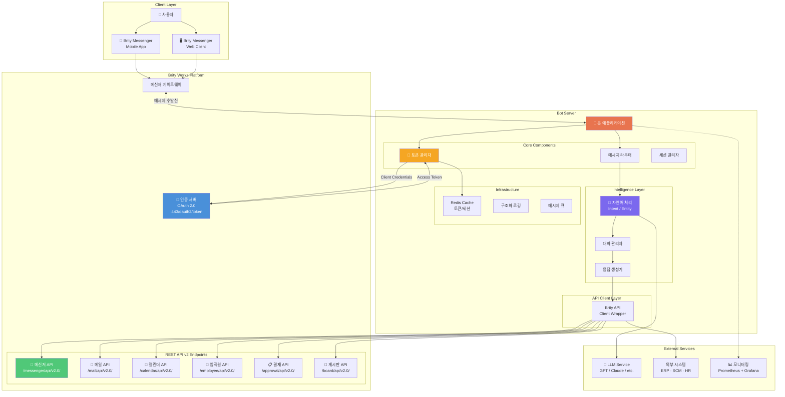

### 4.2 Brity Works API 맵

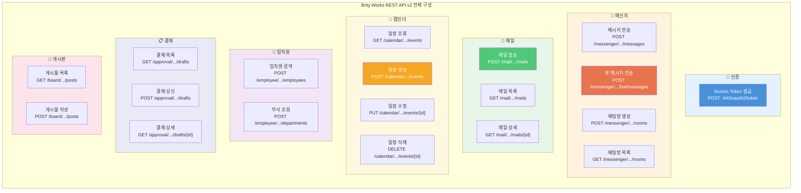

### 4.3 봇 서버 내부 컴포넌트 구성도

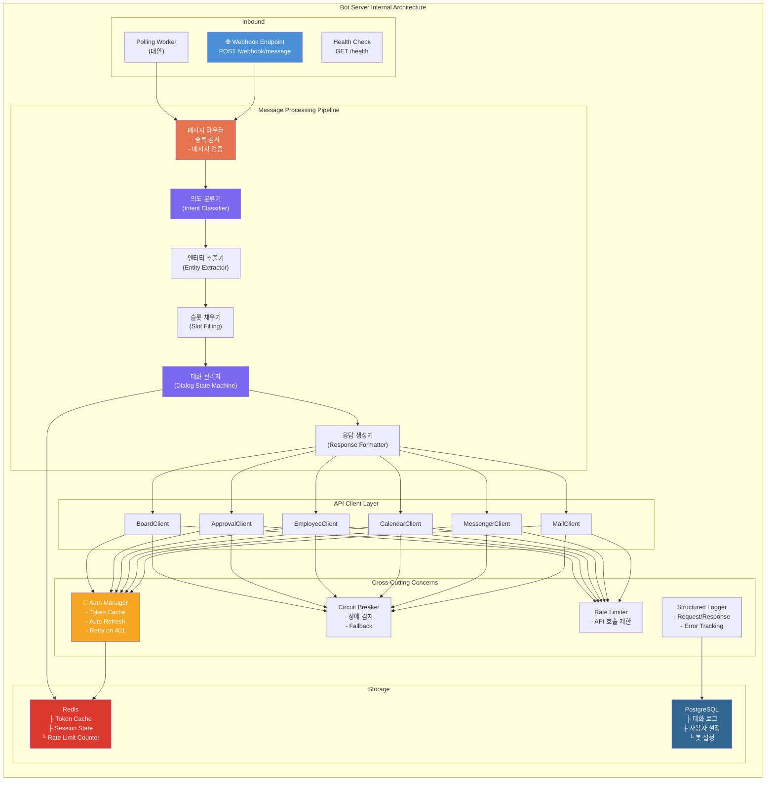

---

## 5. 시퀀스 다이어그램

### 5.1 OAuth 2.0 인증 플로우

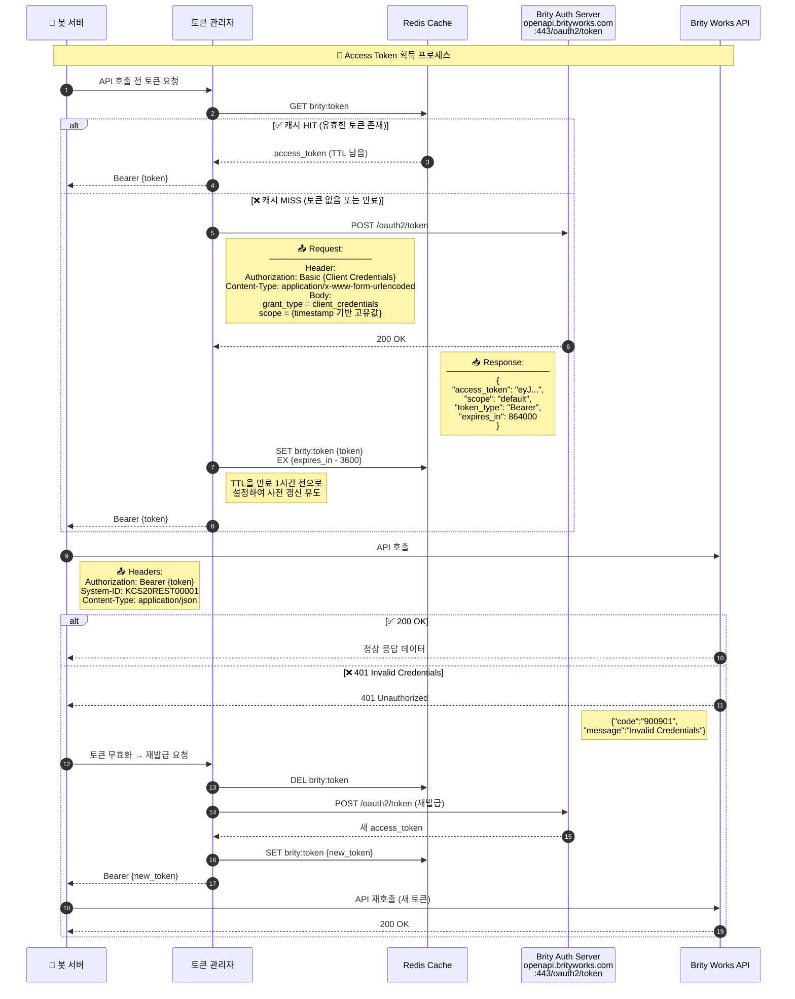

### 5.2 메신저 봇 메시지 수발신 전체 플로우

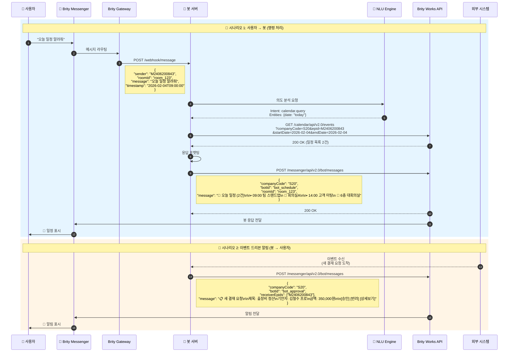

### 5.3 API 호출 공통 패턴 (Circuit Breaker 포함)

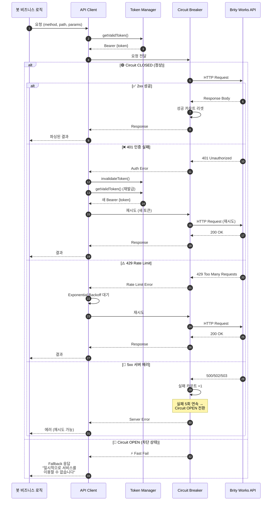

### 5.4 다중 턴 대화 (일정 등록 시나리오)

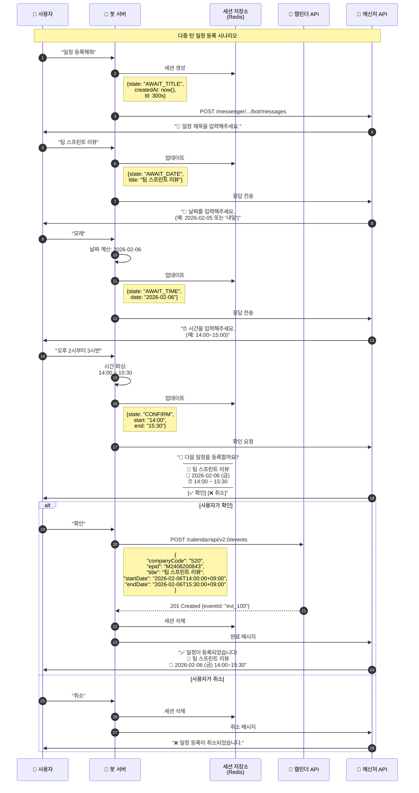

### 5.5 임직원 검색 → 메일 발송 연계 시나리오

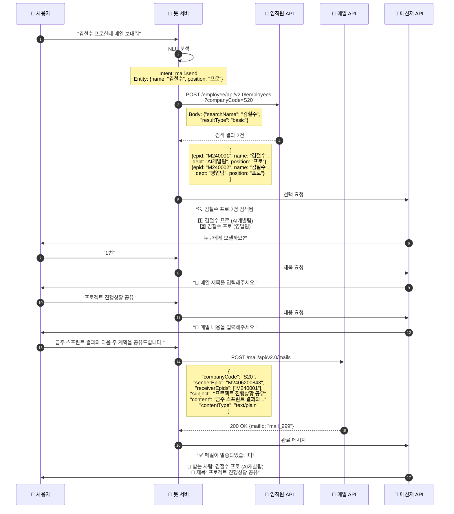

---

## 6. 봇 명령어 처리 플로우

### 6.1 전체 명령어 라우팅

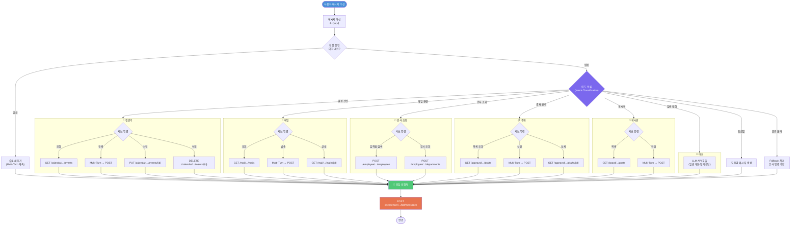

### 6.2 봇 지원 명령어 표

| 카테고리 | 명령어 예시 | Intent | 호출 API |
|---------|-----------|--------|---------|
| **일정** | "오늘 일정 알려줘" | calendar.query | GET /calendar/.../events |
| | "내일 2시에 회의 등록" | calendar.create | POST /calendar/.../events |
| | "오후 3시 회의 취소" | calendar.delete | DELETE /calendar/.../events/{id} |
| **메일** | "읽지 않은 메일 확인" | mail.query | GET /mail/.../mails |
| | "김철수한테 메일 보내줘" | mail.send | POST /mail/.../mails |
| **인사** | "김철수 프로 연락처" | employee.search | POST /employee/.../employees |
| | "개발팀 조직도" | dept.query | POST /employee/.../departments |
| **결재** | "미결 결재 확인" | approval.pending | GET /approval/.../drafts |
| | "결재 상신해줘" | approval.create | POST /approval/.../drafts |
| **게시판** | "공지사항 확인" | board.query | GET /board/.../posts |
| **일반** | "안녕" / 기타 대화 | chat.general | LLM 호출 |

---

## 7. 토큰 라이프사이클 관리

### 7.1 토큰 상태 머신

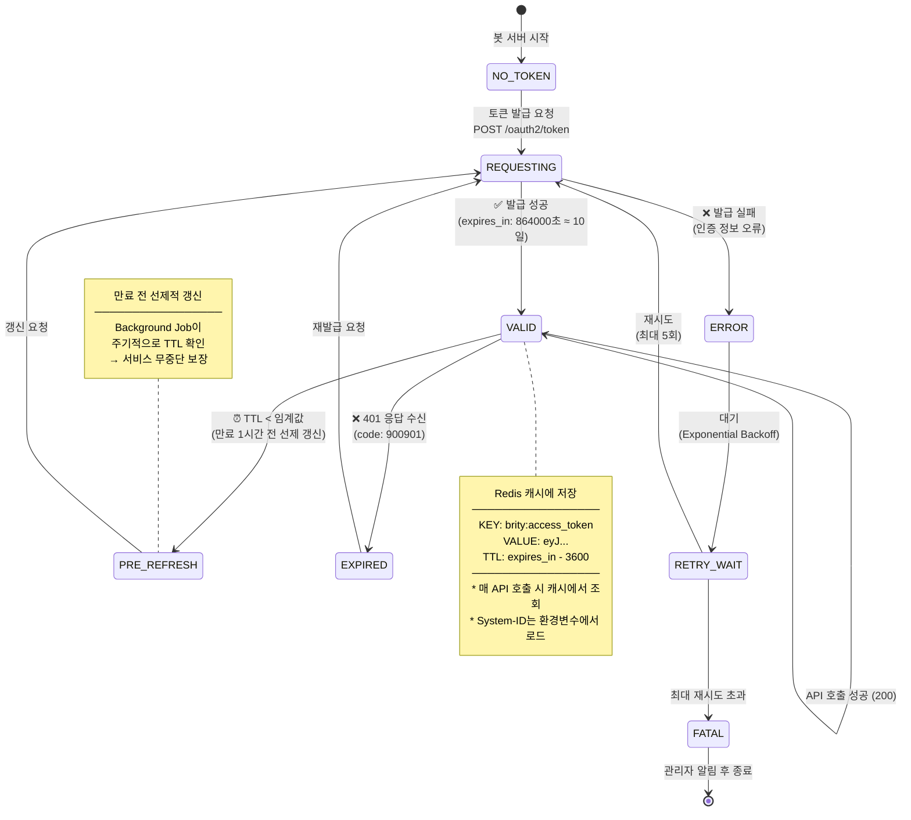

### 7.2 토큰 관리 핵심 로직 (의사코드)

```
class TokenManager:
    cache = Redis
    
    async getValidToken():
        token = cache.get("brity:access_token")
        if token and token.ttl > 0:
            return token
        
        return await refreshToken()
    
    async refreshToken():
        for attempt in range(MAX_RETRIES):
            try:
                response = POST /oauth2/token
                    Header: Basic {CLIENT_CREDENTIALS}
                    Body: grant_type=client_credentials
                          scope={timestamp}
                
                cache.set("brity:access_token", 
                          response.access_token,
                          ex=response.expires_in - 3600)
                
                return response.access_token
            except AuthError:
                await sleep(2 ** attempt)
        
        raise FatalTokenError("Token refresh failed")
    
    async invalidateToken():
        cache.delete("brity:access_token")
```

---

## 8. 에러 핸들링

### 8.1 에러 처리 플로우

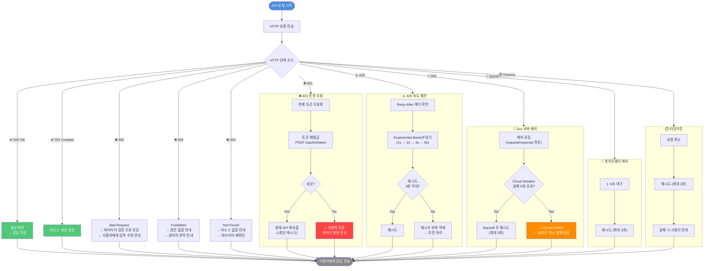

### 8.2 에러 코드 요약

| HTTP Status | Brity Code | 의미 | 봇 처리 방식 |
|-------------|-----------|------|------------|
| 200 | - | 성공 | 정상 응답 |
| 201 | - | 생성 성공 | 정상 응답 |
| 400 | - | 잘못된 요청 | 입력값 검증 → 사용자 안내 |
| 401 | 900901 | Invalid Credentials | 토큰 재발급 후 재시도 |
| 403 | - | 권한 없음 | 관리자 문의 안내 |
| 404 | - | 리소스 없음 | 대상 확인 안내 |
| 429 | - | 속도 제한 | Backoff 후 재시도 |
| 500 | - | 서버 에러 | 3회 재시도 → Circuit Breaker |
| 502/503 | - | 게이트웨이 에러 | 대기 후 재시도 |

---

## 9. 배포 아키텍처

### 9.1 배포 구성도

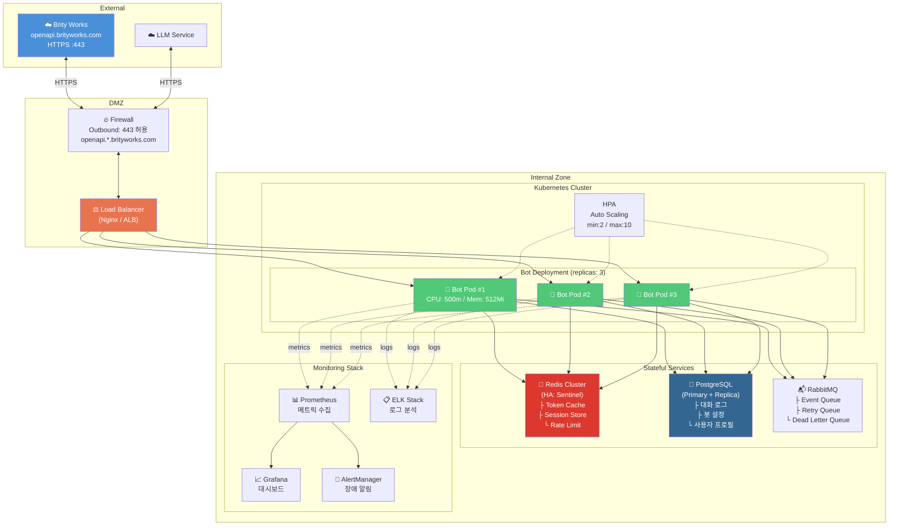

### 9.2 네트워크 / 방화벽 정책

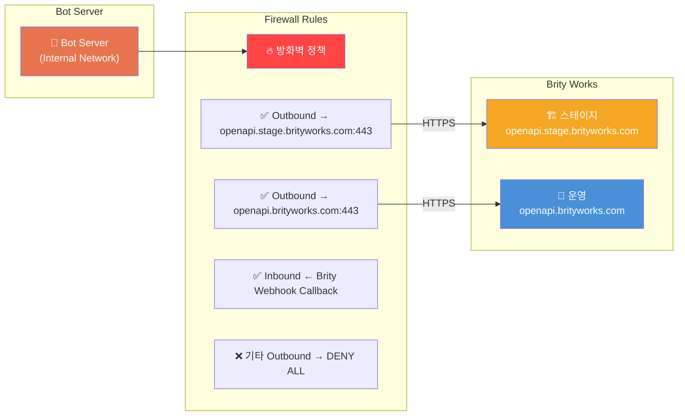

---

## 10. 부록

### 10.1 API 엔드포인트 종합 Quick Reference

| # | 도메인 | 엔드포인트 | Method | 설명 |
|---|--------|-----------|--------|------|
| 1 | **인증** | `:443/oauth2/token` | POST | Access Token 발급/갱신 |
| 2 | **메신저** | `/messenger/api/v2.0/messages` | POST | 메시지 전송 |
| 3 | **메신저** | `/messenger/api/v2.0/bot/messages` | POST | 봇 메시지 전송 |
| 4 | **메신저** | `/messenger/api/v2.0/rooms` | POST | 채팅방 생성 |
| 5 | **메신저** | `/messenger/api/v2.0/rooms` | GET | 채팅방 목록 조회 |
| 6 | **메일** | `/mail/api/v2.0/mails` | POST | 메일 발송 |
| 7 | **메일** | `/mail/api/v2.0/mails` | GET | 메일 목록 조회 |
| 8 | **메일** | `/mail/api/v2.0/mails/{mailId}` | GET | 메일 상세 조회 |
| 9 | **캘린더** | `/calendar/api/v2.0/events` | GET | 일정 조회 |
| 10 | **캘린더** | `/calendar/api/v2.0/events` | POST | 일정 생성 |
| 11 | **캘린더** | `/calendar/api/v2.0/events/{eventId}` | PUT | 일정 수정 |
| 12 | **캘린더** | `/calendar/api/v2.0/events/{eventId}` | DELETE | 일정 삭제 |
| 13 | **임직원** | `/employee/api/v2.0/employees` | POST | 임직원 검색 |
| 14 | **임직원** | `/employee/api/v2.0/departments` | POST | 부서 조회 |
| 15 | **결재** | `/approval/api/v2.0/drafts` | GET | 결재 목록 조회 |
| 16 | **결재** | `/approval/api/v2.0/drafts` | POST | 결재 상신 |
| 17 | **결재** | `/approval/api/v2.0/drafts/{draftId}` | GET | 결재 상세 조회 |
| 18 | **게시판** | `/board/api/v2.0/posts` | GET | 게시물 목록 조회 |
| 19 | **게시판** | `/board/api/v2.0/posts` | POST | 게시물 작성 |

### 10.2 공통 Request Header

모든 API 호출 시 아래 헤더를 포함해야 합니다:

```
Authorization: Bearer {access_token}
System-ID: {발급받은 System-ID}
Content-Type: application/json
Accept: application/json
```

### 10.3 환경별 Base URL

| 환경 | Base URL | 용도 |
|------|----------|------|
| 스테이지 | `https://openapi.stage.brityworks.com` | 개발/테스트 |
| 운영 | `https://openapi.brityworks.com` | 프로덕션 |

### 10.4 봇 개발 체크리스트

- [ ] 연계 신청 완료 (System-ID, Client Credentials 발급)
- [ ] 방화벽 오픈 신청 (Outbound → openapi.*.brityworks.com:443)
- [ ] 스테이지 환경 Access Token 발급 테스트
- [ ] 임직원 조회 API 연동 확인
- [ ] 메신저 봇 메시지 전송 테스트
- [ ] 토큰 자동 갱신 로직 구현
- [ ] 에러 핸들링 / Circuit Breaker 구현
- [ ] 다중 턴 대화 세션 관리 구현
- [ ] 운영 환경 전환 및 최종 테스트
- [ ] 모니터링 / 알림 설정

### 10.5 참고 링크

- Brity Works Dev Center: API별 상세 파라미터는 Dev Center 내 Dev Guide 메뉴 참조
- v1 연계 신청 가이드: Support 페이지 참조
- API별 상세 파라미터는 Dev Center 내 Dev Guide 메뉴를 참고 바랍니다.

---

> **⚠️ 주의사항**: 본 문서의 API 스펙은 Dev Center 스크린샷 이미지에서 추출한 정보로, 이미지 해상도 제한으로 인해 일부 파라미터의 정확한 명칭이나 제약조건이 원본과 다를 수 있습니다. 반드시 Brity Works Dev Center의 최신 API 문서와 대조하여 사용하시기 바랍니다.
